# ENGLISH VERSION
# Interior Design Project Manager – Frontend

A frontend application built with **Angular**, forming part of a system designed to manage interior design projects and streamline communication between design studios, clients, and suppliers.  
The project was created in response to a real business need to replace Excel spreadsheets with a single, coherent online tool that organizes the entire investment process — from concept to ordering.

## 🎯 Application Goal

The main goals of the application are to:

- improve collaboration between the design studio and the client,
- organize material and product specifications,
- automate communication (comments, notifications, emails),
- present data in a clear and user-friendly way on both desktop and mobile devices.

The frontend serves as the **primary user interface** for:

- interior designers,
- clients (public view without login),
- suppliers (dedicated links with limited data access).

---

## 🛠️ Tech Stack

- **Angular**
- **TypeScript**
- **RxJS**
- **PrimeNG**
- **CSS**
- Responsive design for clients (desktop + mobile)
- API integration (NestJS)

---

## ✨ Key Features

### 🔐 Authentication

- user login,
- password change,
- protected application views.

---

### 📊 Project Specifications

- creating and editing project specifications for clients,
- tab-based structure (e.g. kitchen, bathroom, lighting, furniture),
- dynamic columns with saved widths per project,
- drag & drop reordering of items,
- cloning, deleting, and editing items,
- automatic net and gross price calculations,
- item statuses with visual indicators (colors, included/excluded from totals).

---

# SCREENSHOTS

<table width="600" border="0">
  <tr>
    <td width="50%" valign="top">
    
Set edit view on summary tab

    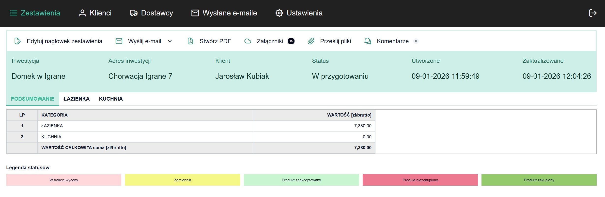    
    
Set edit view - bathroom tab

    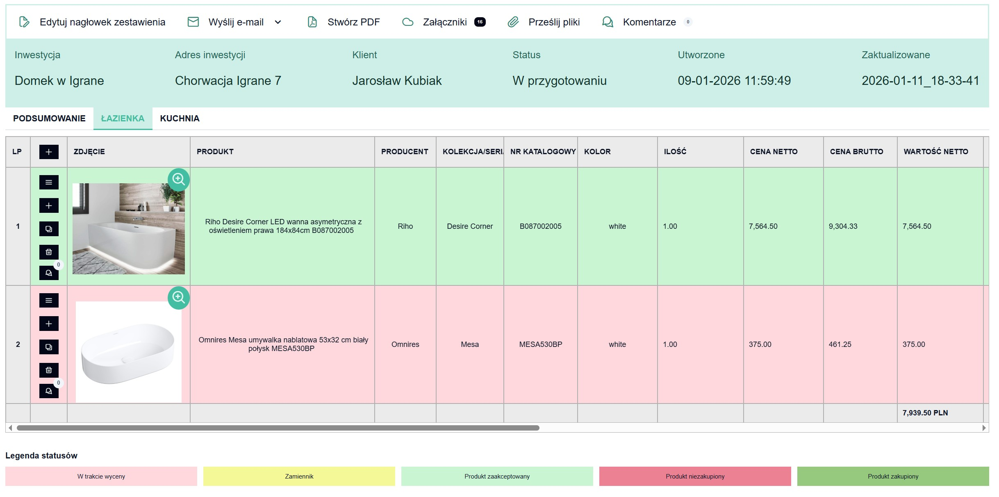    
    
Status select menu - every status has different row color

    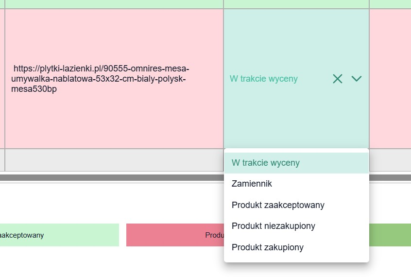    
    </td>
    <td width="50%" valign="top">
    
Client list view

    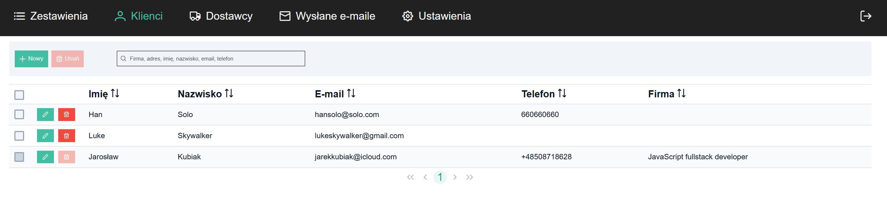    
    
Edit client modal

    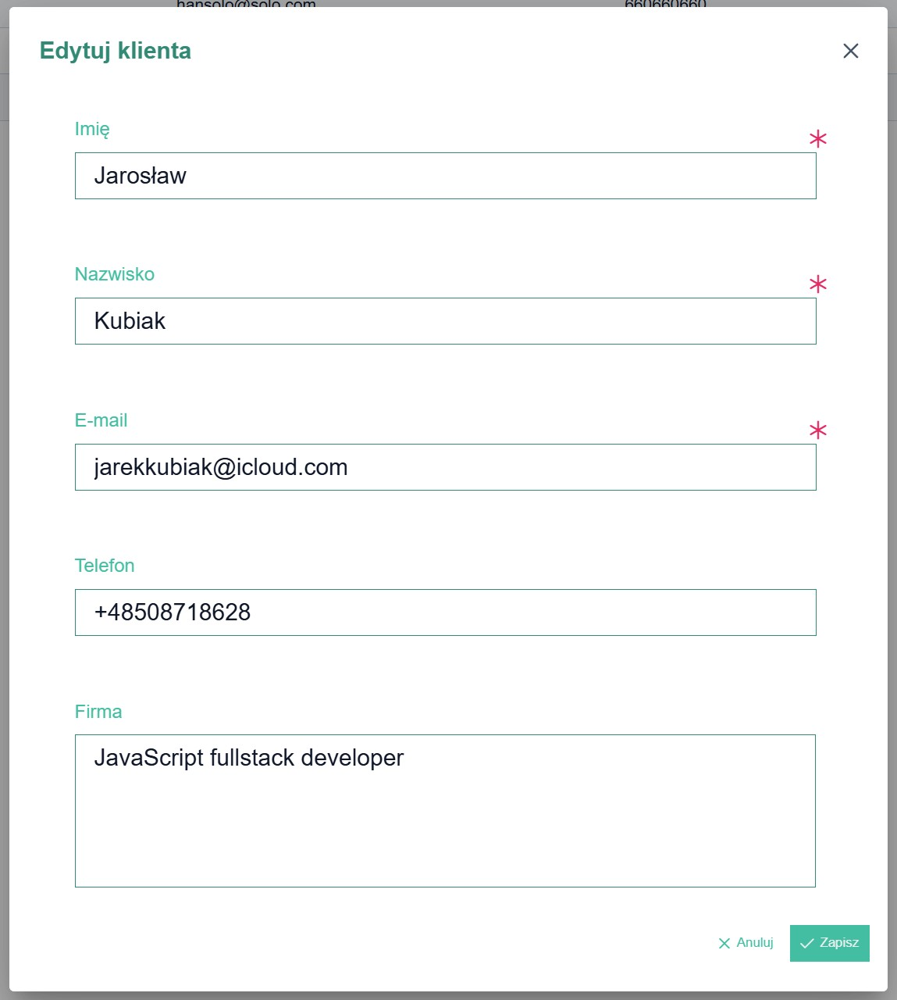    
    
Notification popup

    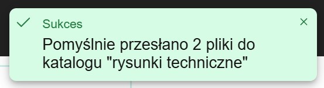
    </td>
  </tr>
</table>

### 🖼️ Media & Attachments

- pasting images directly from the clipboard,
- file uploads as attachments (PDFs, images, other files),
- PDF thumbnail previews,
- folder structure (inspirations, moodboards, visualizations, drawings, working files),
- downloading single files or full ZIP packages.

---

# SCREENSHOTS

<table width="600">
  <tr>
    <td width="50%" valign="top">
    
Send files modal with directory to select

    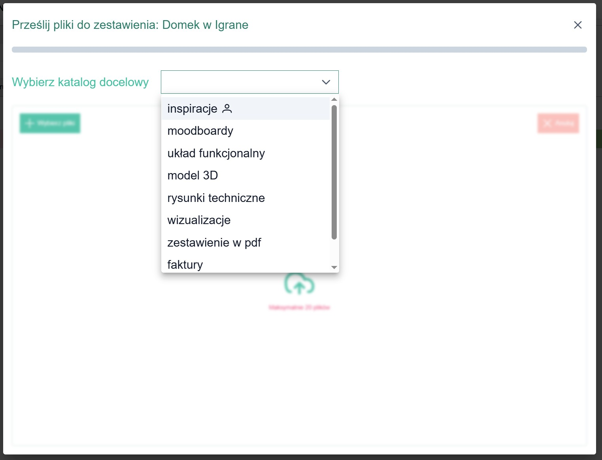    
    
Send files modal with selected files to send

    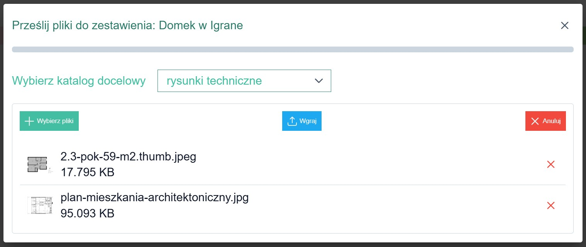
    </td>
    <td width="50%" valign="top">
    
Show files modal - icon view

    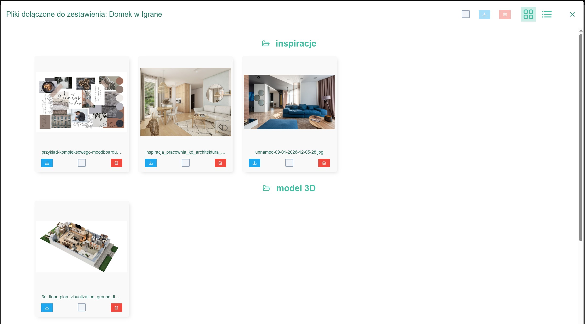    
    
Show files modal - list view

    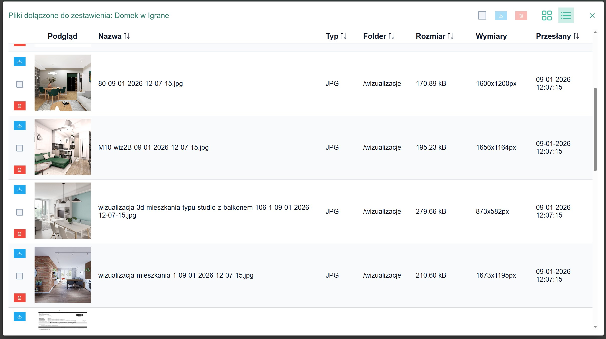    
    
Delete secelted files

    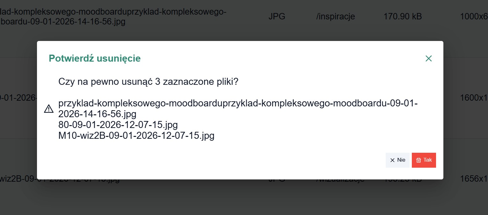
    </td>
  </tr>
</table>

### 💬 Comment System

- comments assigned to specific items,
- client ↔ studio communication,
- read / unread comment tracking,
- notifications about new messages,
- chat-like threaded conversations.

---

# SCREENSHOTS

<table width="600">
  <tr>
    <td width="100%" valign="top">
    
Comments section on every set position - works like text messages

    
  </tr>
</table>

### 📄 PDF Generation

- generating professional PDF specifications:
  - headers and footers,
  - row background styles based on item status,
  - dedicated “Summary” section,
- available options:
  - open PDF in a new tab,
  - download the file,
  - upload to a dedicated FTP folder.

---

### 📧 Email Integration

- sending specifications to clients and suppliers,
- editing email content before sending,
- email sending history,
- hash-based links allowing access without login,
- dedicated views for clients and suppliers with limited data scope.

---

### 📱 Mobile View (Clients)

- fully responsive layout,
- improved image handling,
- mobile-friendly modals and notifications,
- full browsing functionality for project specifications.

---
# SCREENSHOTS

<table width="600" border="0">
  <tr>
    <td width="100%" valign="top">
    
Link for client in mobile view

    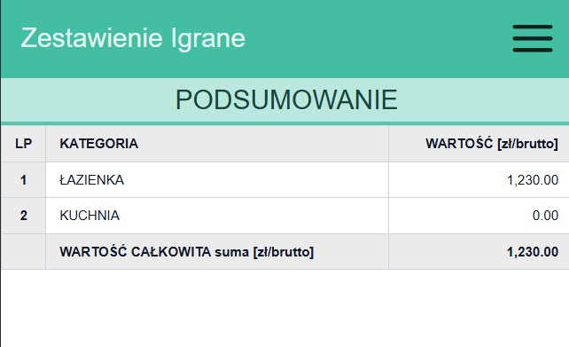    
    
Set menu - mobile view

    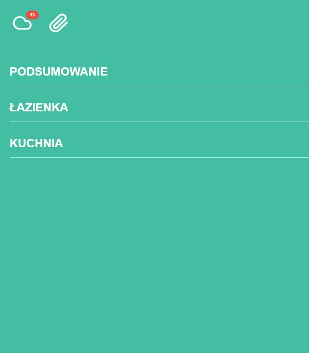    
    
Show attachments - mobile view

    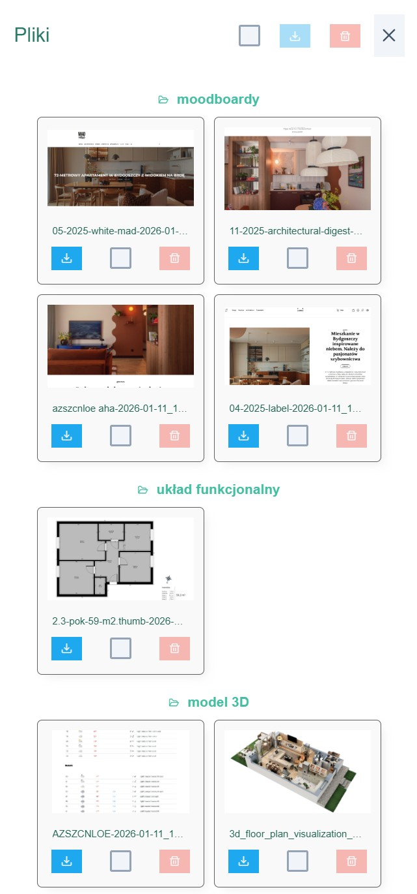
    </td>
  </tr>
</table>

## 👁️ Public Views (No Login Required)

- client view for specification preview,
- dedicated supplier view:
  - only assigned items,
  - no prices or values,
  - consistent table layout.

---

## 🚀 Project Status

The project is under active development.  
Most core features are implemented and tested in a production environment.  
Remaining work focuses mainly on UX improvements, further automation, and notification enhancements.

---

## 👤 Author

This project was created as a real-world application used in an interior design studio  
and as a **frontend portfolio project**.

# POLISH VERSION
# Interior Design Project Manager – Frontend

Aplikacja frontendowa stworzona w **Angular**, będąca częścią systemu do zarządzania projektami wnętrz oraz komunikacją z klientami i dostawcami.  
Projekt powstał jako odpowiedź na realną potrzebę zastąpienia arkuszy Excel jednym, spójnym narzędziem online, które porządkuje proces realizacji inwestycji od koncepcji po zamówienia.

## 🎯 Cel aplikacji

Celem aplikacji jest:

- usprawnienie współpracy biura projektowego z klientem,
- uporządkowanie zestawień materiałów i produktów,
- automatyzacja komunikacji (komentarze, powiadomienia, e-maile),
- czytelna prezentacja danych zarówno na desktopie, jak i na urządzeniach mobilnych.

Frontend pełni rolę **głównego interfejsu użytkownika** dla:

- projektantów,
- klientów (widok bez logowania),
- dostawców (dedykowane linki z ograniczonym zakresem danych).

---

## 🛠️ Stack technologiczny

- **Angular**
- **TypeScript**
- **RxJS**
- **PrimeNG**
- **CSS**
- Responsive design dla klientów (desktop + mobile)
- Integracja z API (NestJS)

---

## ✨ Kluczowe funkcjonalności

### 🔐 Autoryzacja

- logowanie użytkowników,
- zmiana hasła,
- ochrona widoków aplikacji.

---

### 📊 Zestawienia projektowe

- tworzenie i edycja zestawień dla klientów,
- podział na zakładki (np. kuchnia, łazienka, oświetlenie, meble),
- dynamiczne kolumny i zapamiętywanie ich szerokości,
- drag & drop pozycji,
- klonowanie, usuwanie i edycja pozycji,
- automatyczne przeliczanie cen netto i brutto,
- statusy pozycji z wizualnym oznaczeniem (kolory, sumowanie / niesumowanie).

---

### 🖼️ Multimedia i załączniki

- wklejanie obrazów bezpośrednio ze schowka,
- upload plików jako załączniki (PDF, obrazy, inne),
- podgląd miniatur PDF,
- podział na foldery (inspiracje, moodboard, wizualizacje, rysunki, robocze),
- pobieranie pojedynczych plików lub całych paczek ZIP.

---

### 💬 System komentarzy

- komentarze przypisane do konkretnych pozycji,
- komunikacja klient ↔ biuro,
- oznaczanie komentarzy jako przeczytane / nieprzeczytane,
- powiadomienia o nowych wpisach,
- odpowiedzi w formie konwersacji (chat-like).

---

### 📄 PDF

- generowanie profesjonalnych zestawień PDF:
  - nagłówki i stopki,
  - różne tła wierszy zależne od statusu,
  - osobna zakładka „Podsumowanie”,
- możliwość (do wyboru):
  - otwarcia PDF w nowej karcie,
  - pobrania na dysk.
  - przesłania do dedykowanego folderu na FTP

---

### 📧 Integracja e-mail

- wysyłka zestawień do klientów i dostawców,
- edycja treści e-maila przed wysyłką,
- historia wysłanych wiadomości,
- linki z hashami umożliwiające podgląd bez logowania,
- dedykowane widoki dla klientów i dostawców (ograniczony zakres danych).

---

### 📱 Mobile dla klientów

- responsywny layout,
- poprawiona obsługa obrazów,
- dostosowane modale i powiadomienia,
- pełna funkcjonalność przeglądania zestawień.

---

## 👁️ Widoki publiczne (bez logowania)

- podgląd zestawienia przez klienta,
- dedykowany widok dla dostawcy:
  - tylko przypisane pozycje,
  - bez cen i wartości,
  - spójny układ tabel.

---

## 🚀 Status projektu

Projekt jest w aktywnym rozwoju.  
Większość kluczowych funkcji jest wdrożona i przetestowana w środowisku produkcyjnym.  
Pozostałe elementy dotyczą głównie UX, automatyzacji i rozbudowy powiadomień.

---

## 👤 Autor

Projekt stworzony jako aplikacja realnie używana w pracy biura projektowania wnętrz  
oraz jako **element portfolio frontendowego**.
